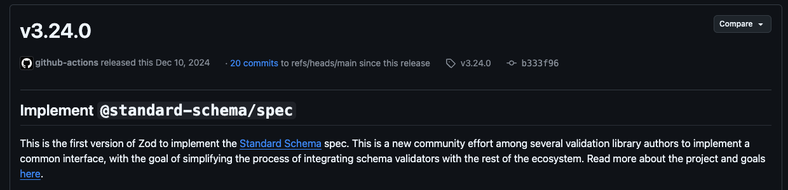
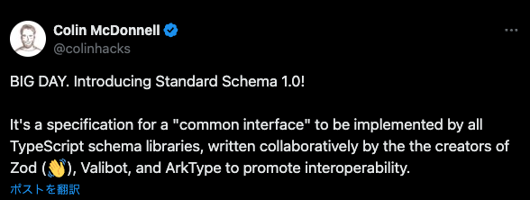
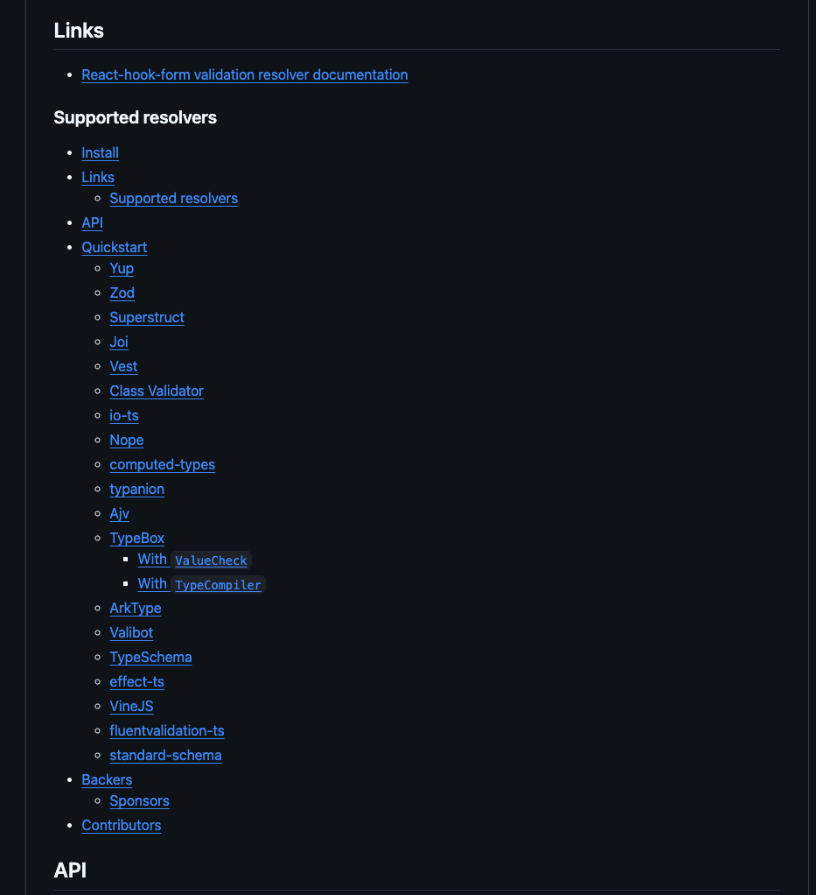
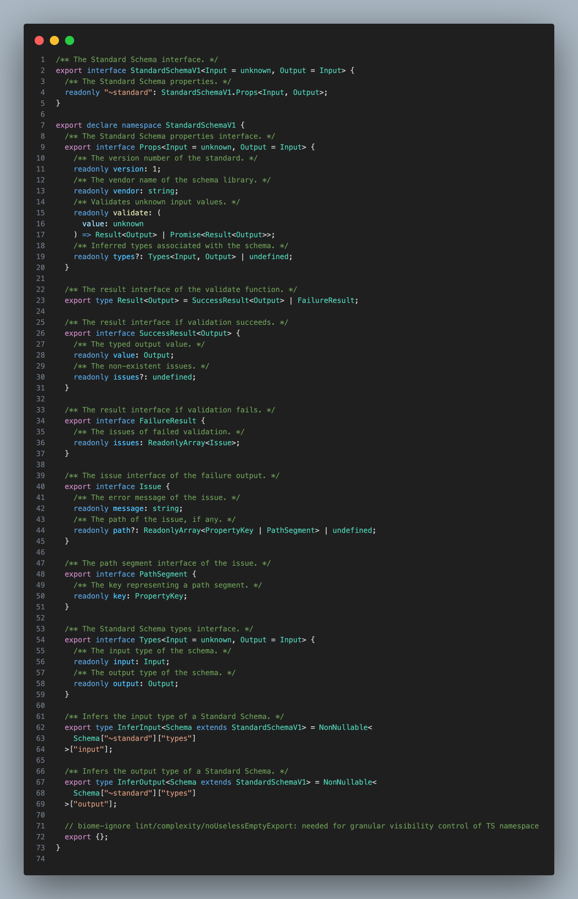
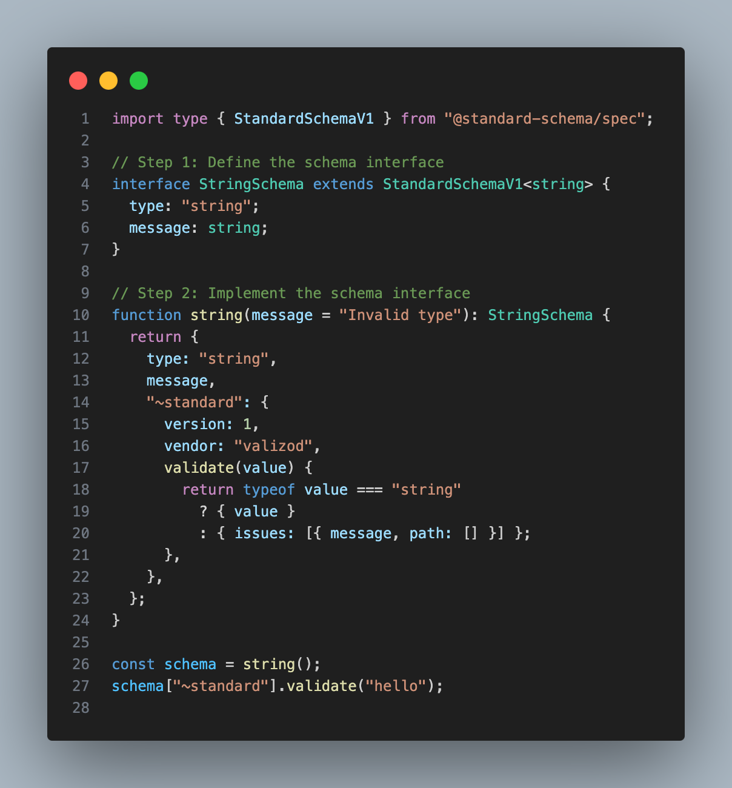
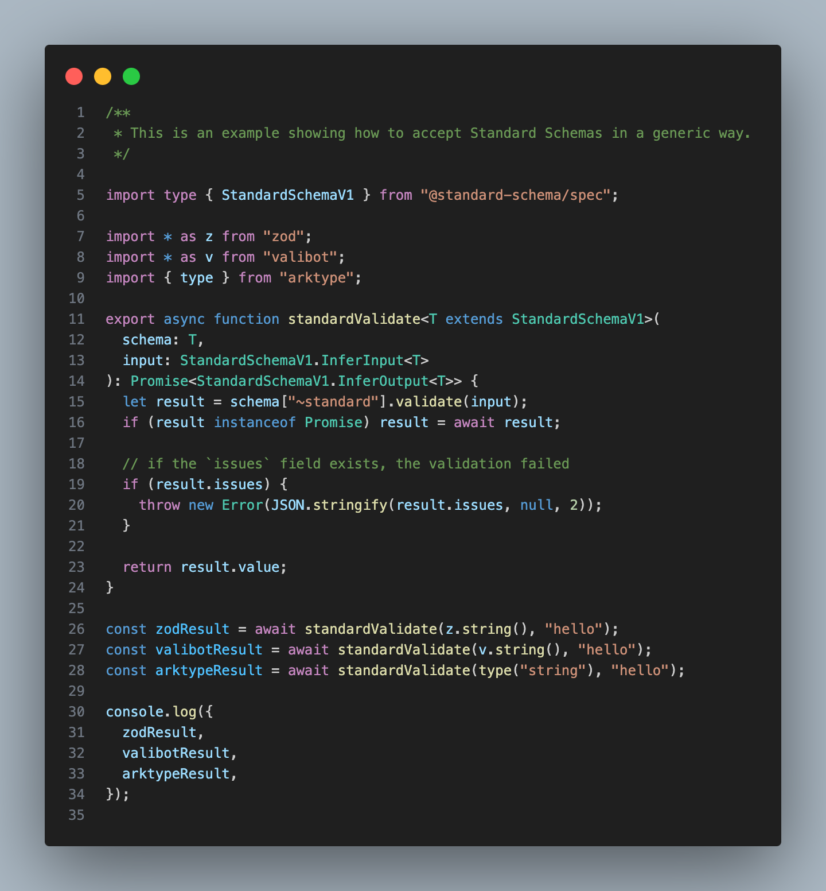

# What is Standard Schema?

[@macchiitaka](https://x.com/macchiitaka) at [Mita.ts #4](https://mitats.connpass.com/event/340629/)（2025-02-26）

---

2024 月 12 月某日、`Zod` のリリースノートにて `@standard-schema/spec` なる仕様に遭遇

https://github.com/colinhacks/zod/releases/tag/v3.24.0

---

`@standard-schema/spec`? 🤔🤔🤔

---

作成者曰く...

> これは、Zod（👋）、Valibot、ArkType の作成者が、相互運用性を促進するために共同で作成した、すべて TypeScript スキーマライブラリが実装する「共通インターフェース」の仕様です。

https://x.com/colinhacks/status/1883907825384190418

---

≒ TypeScript スキーマライブラリが実装する「共通の型」を定義した

---

Standard Schema が生まれる前の世界

---

TypeScript スキーマライブラリと組み合わせて使うライブラリやフレームは

スキーマライブラリごとの API の違いを吸収するために

個別の `Resolver` や `Plugin` を提供している

---

- React Hook Form
- Hono
- tRPC
- TanStack Router
- ...

---

`react-hook-form/resolvers` を覗いてみよう

https://github.com/react-hook-form/resolvers

---

---

各スキーマライブラリと連携するために

スキーマライブラリ毎に `Resolver` を提供している...

---

これはツライ 😇😇😇

---

Standard Schema がある世界

---

スキーマライブラリが Standard Schema に対応していれば

連携するライブラリは Standard Schema 向けの `Resolver` や `Plugin` だけ

提供すれば OK

---

`Resolver` をたくさん作らなくていい 🎉🎉🎉

---

つまり嬉しいのはだれ？

---

TypeScript スキーマライブラリを利用するライブラリやフレームワークの作者

---

具体のスキーマ定義と実装サンプルを見てみよう

---

スキーマ

https://github.com/standard-schema/standard-schema/blob/main/packages/spec/src/index.ts

---

---

- 100 行未満のコード
- シンプル
- バリデーターの呼び出し方、実行結果、エラーメッセージと位置
- `~standard` プロパティ配下に実装する
  - `~`で始まるプロパティは自動補完の優先順位が低い

---

スキーマライブラリの実装サンプル

https://github.com/standard-schema/standard-schema/blob/main/packages/examples/implement.ts

---

---

スキーマライブラリを呼び出すフレームワークの実装サンプル

https://github.com/standard-schema/standard-schema/blob/main/packages/examples/integrate.ts

---

---

Zod、Valibot、ArkType とひとつの `Resolver` で連携できる

---

幸せな世界 🥳🥳🥳

---

Appendix

- Standard Schema https://standardschema.dev/
- standard-schema/standard-schema: A standard interface for TypeScript schema validation libraries 　https://github.com/standard-schema/standard-schema
- Standard Schema リリース https://x.com/colinhacks/status/1883907825384190418
- Standard Schema Proposal https://x.com/colinhacks/status/1634284724796661761
- Release v3.24.0 · colinhacks/zod https://github.com/colinhacks/zod/releases/tag/v3.24.0
- Release v4.7.0 · honojs/hono https://github.com/honojs/hono/releases/tag/v4.7.0
